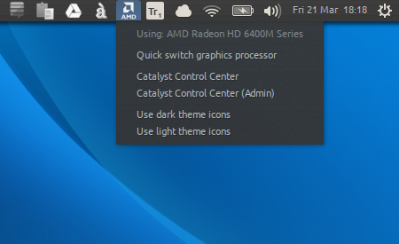

AMD ATI/Intel Indicator for Linux Mint 17 x64 (Cinnamon/MATE)
=============

**An indicator applet for AMD ATI/Intel hybrid graphics _fast_ switching.**

This indicator applet allows owners of laptops with AMD/Intel hybrid graphics capabilities to
easily switch between graphics cards without the need of running ATI CCC or terminal commands (including rebooting
the system). The current version will have to terminate the current user session, however (e.g. done via _Logout_).



Image credits: [Sadi Yumuşak](https://github.com/Sadi58)

Inform yourself
==============
In order for you to know about how things reached this point and some potential issues you might hit on the road on 
getting your hybrid setup to work, it could be useful to check out the following resources:

 - [Ubuntu Community Help Wiki - BinaryDriverHowto/AMD](https://help.ubuntu.com/community/BinaryDriverHowto/AMD) - 
 contains information on how the drivers will work with your Intel/AMD hybrid graphics machine.

 - [Ubuntu Forums - AMD/Intel Hybrid Graphics works](http://ubuntuforums.org/showthread.php?t=1930450) thread - an 
 article for the more technically inclined folks which want to find out about how a solution came to be. For example,
 while developing the version for Linux Mint I had hit some issues like missing files or packages on my system, before
 being able to fully utilize the indicator application.

 - [Ask Ubuntu - How do I get AMD/Intel Hybrid Graphics drivers to work?]
 (http://askubuntu.com/questions/205112/how-do-i-get-amd-intel-hybrid-graphics-drivers-to-work/379286#379286) - how the 
 folks got a version of this application working for Ubuntu, which was later ported to Linux Mint. 

Prerequisites
==============

You will need to be comfortable working with the CLI, because a few packages are required to be installed beforehand in
 order to take advantage of this indicator.

**Make sure you have the proper AMD ATI drivers - _fglrx_ variant, NOT _fglrx-updates_ - installed, preferably via
 Mint's _Driver Manager_ application. However, installing via CLI, as you will see below, should work as well.** (Note: This 
 application has been built for Linux Mint 17.3 and was tested with version 15.200.1xxx of the ATI drivers on a x64 
 installation). 

In case the indicator application doesn't start because it is missing the **python module "_appindicator_"**, again, make sure to 
install missing packages.

For example, to install all the needed dependencies via CLI, you can enter the following command in a terminal window:

```sudo apt-get install fglrx python-appindicator```

How to install
==============

Make the `setup.sh` file executable and run it using `sudo`, entering the following commands in terminal:

```
chmod a+x setup.sh
sudo ./setup.sh
```


Credits
==============

**Original code for this indicator application is authored by** [Alfred Neumayer](https://github.com/beidl/amd-indicator).

Other possible contributions may include (and are not limited to) the following authors:

 - [Sadi Yumuşak](https://github.com/Sadi58)
 - [picccard](https://github.com/picccard)
 - [Михайлов Антон](https://github.com/anion155)


**From my research, all this is based on a solution originally offered by [Marian Lux](http://askubuntu.com/users/29483/marian-lux), in a discussion thread over at: 
[Ask Ubuntu - How do I get AMD/Intel Hybrid Graphics drivers to work?](http://askubuntu.com/questions/205112/how-do-i-get-amd-intel-hybrid-graphics-drivers-to-work/288355#288355)**
